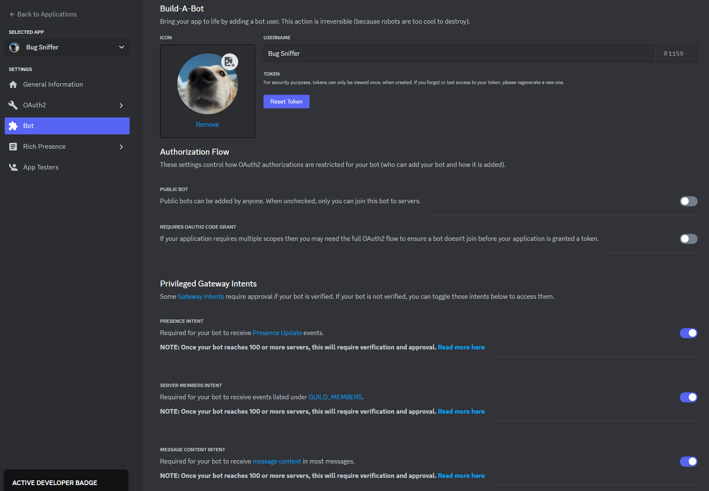

Intents are a way to let the gateway know what events we want, for example for a bot that will just send random GIFs, we don't need to know when a reaction has been added to a message.

## What intents do I need?

That all depends on the use cases of the bot. You can use the [**Intents Calculator**][/intents-calculator] and choose the intents/events you need, and it will show the intents you need or the value you need to give.

When passing intents in Centauri, it is recommended to pass the intents with appropriate names rather than the integer value that may be confusing. For example if we want the `GUILD_MESSAGES` and be able to read message content, we can use create a gateway client with the following line.

```go
botClient := centauri.NewGatewayClient("Bot BOT_TOKEN", discord.IntentsGuildMessages|discord.IntentsMessageContent)
```

You can let IntelliSense to the job to know the list of intents, or check them out [here](https://pkg.go.dev/github.com/kkrypt0nn/centauri@/discord#Intents).

## Privileged Intents

Privileged intents need to be enabled in the [Developer Portal](https://discord.com/developers/applications) under your application's bot settings.



If your bot is **not verified**, you can enable or disable them as you wish.

If your bot **is verified**, you will have to be approved to get access to these intents, so only ask them if you really need them. You can read more about that [here](https://support.discord.com/hc/en-us/articles/360040720412#privileged-intent-whitelisting).

### Guild Presences

The guild presences intent needs to be set when you want to handle the `PRESENCE_UPDATE` events.

### Guild Members

The guild members intent needs to be set when you want to handle the following events:

* `GUILD_MEMBER_ADD`
* `GUILD_MEMBER_UPDATE`
* `GUILD_MEMBER_REMOVE`
* `THREAD_MEMBERS_UPDATE`

### Message Content

The message content intent needs to be enabled when you want to read the content of messages.

:::info

You **do not need** this intent for messages that are in the bot's private messages or for messages where the bot is mentioned in.

:::