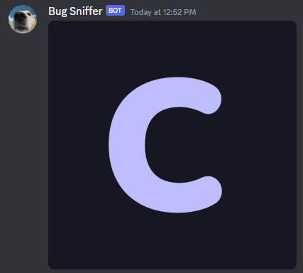

When sending local images in messages you will need to specify them in a special way. It is different for normal messages and for images in embeds.

You can see an example for both normal and embeds [here](https://github.com/kkrypt0nn/centauri/blob/main/_examples/sending_local_images/main.go).

## Normal Messages

When sending local images in a normal message you just need to pass a file in the `Files` field of the`discord.CreateMessage` structure. For example

```go
botClient := centauri.NewRestClient("Bot BOT_TOKEN")

logoFile, err := os.Open("./documentation/static/img/centauri.png")
if err != nil {
    panic(err)
}

_, err = botClient.CreateMessage(123456789, discord.CreateMessage{
	Files: []discord.File{
		{
			Name:   "centauri.png",
			Reader: logoFile,
		},
	},
})
if err != nil {
	botClient.Logger.Error(err.Error())
}
```

This will send Centauri's logo in a messsage:



## Embeds

When sending local images in embeds, it will work the same as for normal messages but you have to use `attachment://<fileName>` in the various image URLs where you want them in the embed. Take this example as a showcase

```go
botClient := centauri.NewRestClient("Bot BOT_TOKEN")

logoFile, err := os.Open("./documentation/static/img/centauri.png")
if err != nil {
    panic(err)
}

_, err = botClient.CreateMessage(123456789, discord.CreateMessage{
    Embeds: []discord.Embed{
        discord.NewEmbedBuilder().SetImage("attachment://centauri.png"),
    },
    Files: []discord.File{
        {
            Name:   "centauri.png",
			Reader: logoFile,
		},
	},
})
if err != nil {
	botClient.Logger.Error(err.Error())
}
```

This will send Centauri's logo in an embed:

