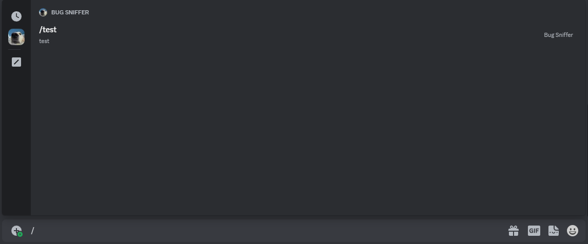

:::note

This guide will eventually be re-written with more details on the options and responses

::: 

Slash commands are a type of interaction available in Discord that makes it easier for users to know what commands a bot has and how to use them. You can check Discord's FAQ [here](https://support.discord.com/hc/en-us/articles/1500000368501-Slash-Commands-FAQ).

You can see an example of a Slash Command implementation [here](https://github.com/kkrypt0nn/centauri/blob/main/_examples/slash_commands/main.go).

## Gateway Client

For slash commands you will have to use the [Gateway Client](/docs/guides/gateway_client). Once you've prepared the client, for example like that

```go
botClient := centauri.NewGatewayClient("Bot BOT_TOKEN", 0)

botClient.On(gateway.EventTypeReady, func(c *gateway.Client, ready *gateway.Ready) {
    botClient.Logger.Info(fmt.Sprintf("We are now logged in as %s", ready.User.Username))
})

// More event handlers will come here

// Creating a global slash command will come here

err := botClient.Login()
if err != nil {
    botClient.Logger.Error(err.Error())
    botClient.Close()
    return
}
```

## Register Slash Commands

You can now think about your slash commands and its options, this guide will just have a command `/test` that has no option. You can then use the [REST Client](/docs/guides/gateway_client/#using-rest-client-with-gateway-client) in your Gateway Client to create a global or guild command, this guide will cover the global command. Here is an example of creating the command mentioned above:

```go
botClient.Rest().CreateGlobalApplicationCommand(discord.CreateGlobalApplicationCommand{
    Name:        "test",
    Description: ptr.New("test"),
})
```

Now the command can be seen in Discord's UI:



## Respond

Now we just need to listen for the **Interaction Create** event and respond accordingly. For the response we will just respond with *"Hello world!"*.

Since the Interaction Create event is disptached for various other interactions, e.g. button clicks, we will first need to check if the type of interaction dispatched if an application command, then we check if the command name is indeed `test` - if it is, we respond with a message. The code for that is the following.

```go
botClient.On(gateway.EventTypeInteractionCreate, func(c *gateway.Client, interaction *gateway.InteractionCreate) {
    if interaction.Interaction.Data.InteractionType() == discord.InteractionTypeApplicationCommand {
        if interaction.Interaction.Data.(*discord.InteractionApplicationCommandData).Name == "test" {
            botClient.Rest().CreateInteractionResponse(interaction.ID, interaction.Token, discord.CreateInteractionResponse{
                Type: discord.InteractionResponseTypeMessage,
                Data: discord.MessageInteractionResponse{
            	    Content: ptr.New("Hello world!"),
                },
            })
        }
    }
})
```

When executing the command, we can see it works fine

