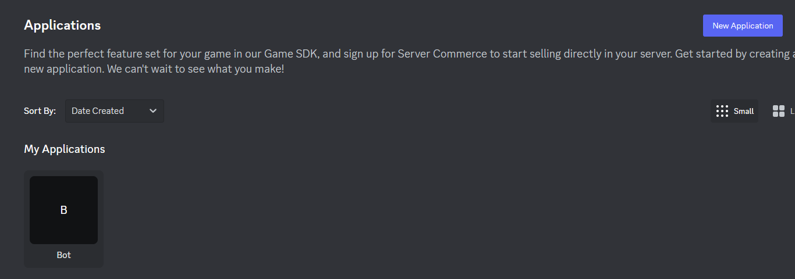
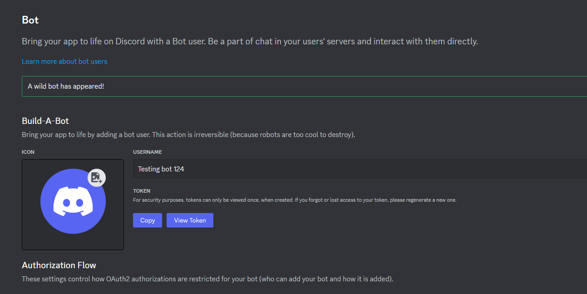

# Token Issues

## Discord Tokens 101

In order for your application to work, you will need to use a so-called **token**. Such a token is composed as a mix of letters, numbers and symbols, which is essential for your application. It acts as a key to send REST API request and connect to Discord's Gateway. That way it will be possible for you to control a Discord bot and act based on certain events.

Every user account also works with the same token system with some small differences.

:::warning Warning

A token is unique, and **nobody** else should have access to it. If it is the case, reset your bot token **as soon as possible**.

:::

Here is an example of a (now invalidated) Discord token:

```
OTA5Nzc0MTgyMzM5MDA2NzIu.OXIME5.5MbvcVgSQHiuwRGPX0mlECrNO4-Tgd4RFG5DbE
```

When using Centauri, if you use an **invalid/wrong token**, you might encounter a `discord.Error` with the message being `401: Unauthorized` error while performing requests.

## Get a token

1. First, get into Discord developers portal by [clicking here](https://discord.com/developers/applications)
2. Click on the application you want to get the token from. If there is none, create one with the **_"New Application"_** button.
   
3. You can then click on the **_"Bot"_** tab to the left, and click **_"Add Bot"_** if not already done. Then, click **_"Copy"_** under the token section!
   

Your bot's token should now be copied into your clipboard, and you may use that token in Centauri.

## Use the token in Centauri

Now that you have your bot's token, you need to paste it into the function to create a new REST client in order for Centauri to work properly.

After following the [installation](/docs/installation/) guide you can now create a new REST client with the following code:

```go
botClient := centauri.NewRestClient("Bot BOT_TOKEN")
```

:::note

When giving the **bot's** token you will have to pass `Bot` as prefix, note the difference below:

```go
botClient := centauri.NewRestClient("Bot BOT_TOKEN") // Good
botClient := centauri.NewRestClient("BOT_TOKEN") // Not good
```

:::

Here is some most basic code that you may use to test:

```go showLineNumbers
package main

import (
	"fmt"
	"github.com/kkrypt0nn/centauri"
)

func main() {
	botClient := centauri.NewRestClient("Bot BOT_TOKEN")
	bot, err := botClient.GetCurrentUser()
	if err != nil {
		fmt.Println(err)
	} else {
       fmt.Println(fmt.Sprintf("Got bot %s with ID %s", bot.Username, bot.ID))
	}
}
```

You should now see in the console your bot's username and ID.

## More issues

If the explanations from this page do not help you with your issue(s), please join our [Discord server](https://discord.gg/feA6ZGRgpw) to get further assisted help.
