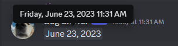

Centauri offers some useful utilities packages that is often used when coding bots.

## Flags

:::info

These functions are already implemented for the Discord structures. For example if you have a [`User`](https://pkg.go.dev/github.com/kkrypt0nn/centauri/discord#User) structure the [user's flags](https://pkg.go.dev/github.com/kkrypt0nn/centauri/discord#UserFlags) structure has the various needed methods implemented. So you can directly use

```go
user.PublicFlags.Has(discord.UserFlagHypeSquadBravery) // True if the user is part of the HypeSquad Bravery
```

:::

The [flags package](https://pkg.go.dev/github.com/kkrypt0nn/centauri/utils/flags) provides helpers to handle bitwise flags which are used for permissions, user flags, message flags, etc. The methods available can be seen in the [Go Reference documentation](https://pkg.go.dev/github.com/kkrypt0nn/centauri/utils/flags).


## Timestamp

The [timestamp package](https://pkg.go.dev/github.com/kkrypt0nn/centauri/utils/timestamp) provides helpers to send messages in a time format on Discord, as shown here:



The code used for the example above was the following.

```go
timestamp.FormatTime(time.Now(), timestamp.FormatTypeLongDate))
```

The function and different formats available can be seen in the [Go Reference documentation](https://pkg.go.dev/github.com/kkrypt0nn/centauri/utils/timestamp).